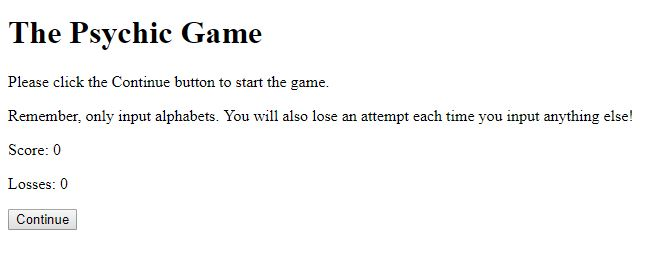
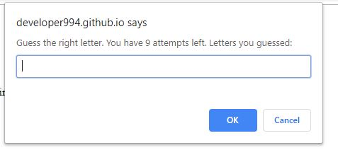
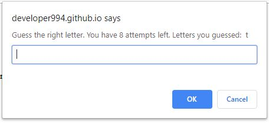
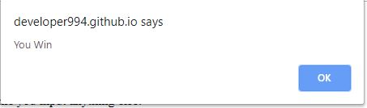
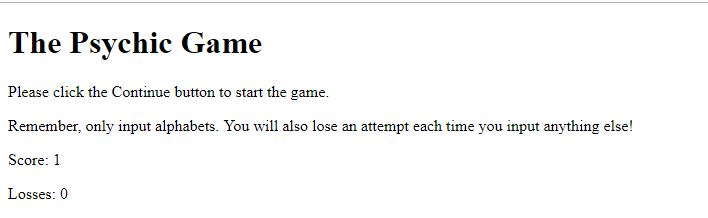
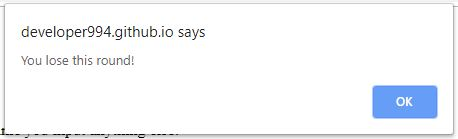
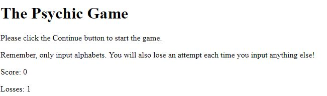

# Psychic-Game

### Overview

In this game, the player is requested to choose the secret letter when the player clicks the continue button. The player gets 9 tries. 

### Instructions
1. User lands on the main page when click on the app's deployment link:

 

2. When the user clicks on the continue button, the dialogue pops up:

 

3. On the dialogue above, it shows the attempts left. This goes down on each wrong input as it goes down from 9 to 8 in the image below:

 

4. If the user inputs the right letter, they are informed of winning and the score goes up:

 

 

5. If they get all 9 guesses wrong, then they are informed of lossing and the losses go up:

### Technologies

The technologies used to build this app include:
* HTML
* CSS
* Javascript

### Known Issues

* Once the user starts the game, there is not way of quitting ( e.g. If they hit the cancel button or refresh the page, the number of guesses left will go down instead of the dialogue disappear)